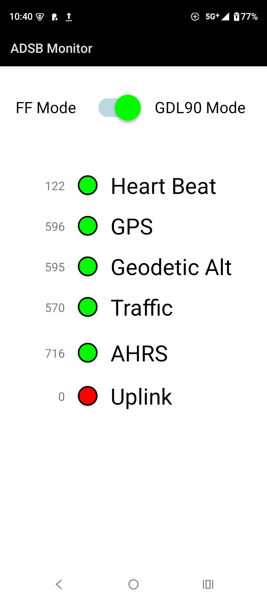

The Stratus3 ADSB receiver is known to automatically switch to a proprietary mode when it connects with Foreflight. This renders it unusable with all other apps like Avare, Garmin Pilot etc.. The only way to switch it back to the GDL90 open mode is to use the Horizon Pro app by Stratus (which unfortunately only runs on an iPad). I wrote this app so that Android users can switch the Stratus3 back to the GDL90 mode. Please note Stratus2 cannot be switched - it is permanently locked to Foreflight only.

This app also automatically saves the ADSB data to a file under Documents folder, including traffic and uplink weather. This could be useful for review and replay later.

The APK is in app/release/app-release.apk

